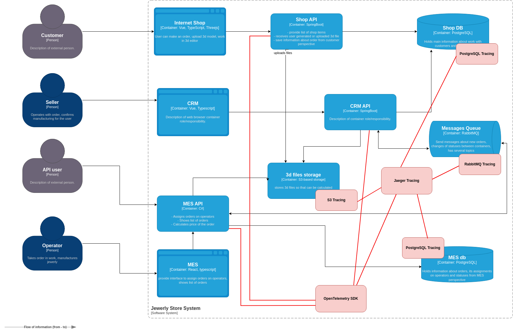
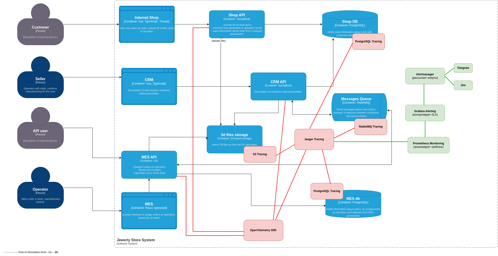

# Архитектурное решение по трейсингу

Трейсинг (распределённая трассировка) необходим для отслеживания пути заказа по системе, выявления узких мест и диагностики проблем в API, очередях сообщений и базах данных.

## Анализ текущей С4-диаграммы в контексте планирования трейсинга

####  Какие системы покрываем трейсингом

На основе C4-диаграммы и анализа точек отказа, трейсинг должен охватывать:

- Критические системы, через которые проходит заказ
	- Shop API (интернет-магазин) → создаёт заказ, отправляет его в CRM.
	- CRM API → обновляет статусы заказов, передаёт их в MES.
	- MES API → принимает заказы, рассчитывает стоимость, контролирует производство.
	- RabbitMQ → передаёт заказы между системами, может терять сообщения.
	- PostgreSQL (Shop DB, MES DB) → хранит заказы, возможны медленные SQL-запросы.
	- 3D Files Storage → загрузка 3D-моделей, может работать медленно.
   
- Критические точки, где заказ может зависнуть или сломаться:
	- Shop API → CRM API → заказ может не передаться в CRM.
	- CRM API → RabbitMQ → заказ может зависнуть в очереди.
	- RabbitMQ → MES API → заказ может не дойти до производства.
	- MES API → PostgreSQL → проблемы с расчётом стоимости и обновлением статусов.
	- MES API → 3D Files Storage → проблемы с загрузкой 3D-моделей.

#### Список данных, которые должны попадать в трейсинг

- Общие данные для всех запросов
	- Trace ID – общий идентификатор для всех операций по заказу.
	- Span ID – идентификатор каждой операции внутри одного трейсинга.
	- Timestamp (Start Time / End Time) – когда операция началась и завершилась.
	- Service Name – название сервиса (shop-api, crm-api, mes-api).
	- Operation Name – что выполнялось (POST /orders, PUT /status, SQL Query).
	- User ID – если есть аутентификация, ID пользователя.
- API-запросы (Shop API, CRM API, MES API)
	+ URL и метод запроса (GET, POST, PUT, DELETE)
	+ Статус ответа (200, 400, 500)
	+ Время выполнения запроса (Latency P95, P99)
	+ Размер запроса и ответа (KB)
- Очередь сообщений (RabbitMQ Tracing)
	+ Имя очереди (orders.queue, calculation.queue).
	+ Время жизни сообщения (time in queue).
	+ Количество повторных попыток (Retries).
	+ Ошибка обработки (если есть).
- Базы данных (PostgreSQL Queries)
	- SQL-запрос (если длиннее 500 мс).
	- Время выполнения запроса.
	- Блокировки транзакций.
	- Индекс использовался или нет.
- Загрузка 3D-моделей (S3-хранилище)
	+ Время загрузки файла.
	+ Размер файла.
	+ Ошибки при загрузке (если есть).

#### Трейсинг заказа

1. Shop API (интернет-магазин) 
	- POST /orders → Создаёт заказ, записывает в Shop DB, отправляет в CRM.
 	- Логирует Trace ID, User ID, SQL-запрос в БД, статус API-ответа.
2. CRM API (Система управления заказами)
	- `PUT /status` → Принимает заказ, передаёт его в RabbitMQ.
	- Логирует Trace ID, статус заказа, время обновления в БД, очередь RabbitMQ.
3. RabbitMQ (Очередь сообщений)
	- `orders.queue` → Сообщение ждёт обработки MES API.
	- Логирует время в очереди, количество ретраев, ошибку (если есть).
4. MES API (Система производства)
	- `GET /orders` → Читает заказ, рассчитывает стоимость, загружает 3D-модель.
	- Логирует Trace ID, время расчёта стоимости, загрузку 3D-файла.
5. PostgreSQL (MES DB)
	- `INSERT INTO manufacturing` → Записывает расчёт стоимости.
	- Логирует время выполнения SQL-запроса, блокировки БД.

## Мотивация

Внедрение трейсинга (distributed tracing) позволит полностью отслеживать путь заказа через систему и быстро находить проблемы, из-за которых заказы зависают или обрабатываются слишком долго.

**Основные проблемы без трейсинга:**
- ❌ Заказы зависают на неопределённое время, и невозможно понять, где именно.
- ❌ Ошибки сложно диагностировать, разработчики тратят много времени на поиск причины.
- ❌ Нет прозрачности API – B2B-клиенты жалуются, что заказы теряются, но нельзя доказать, на каком этапе.
- ❌ Медленные SQL-запросы тормозят систему, но непонятно, какие именно.

**Что даёт трейсинг:**
- ✅ Показывает полный путь заказа в системе → можно точно увидеть, где заказ застрял.
- ✅ Сокращает время диагностики проблем → команда быстро находит причины зависаний.
- ✅ Оптимизирует производительность API и БД → выявляет медленные запросы и узкие места.
- ✅ Уменьшает потери заказов → если заказ завис, система автоматически сигнализирует об этом.
- ✅ Повышает доверие B2B-партнёров → прозрачность API, можно доказать, что заказ обработан корректно.

**Возможные технические и бизнес-метрики решения, на которые повлияет внедрение трейсинга:**
- Среднее время обработки заказа (Order Processing Time)
- Количество зависших заказов (Stuck Orders Rate)
- Производительность API (API Performance – Latency P95, P99)
- Количество повторных попыток (Retries & Failed Requests Rate)
- Количество неуспешных запросов к базе данных (Slow & Failed SQL Queries Rate)

> **Вывод**: Внедрение трейсинга позволит обрабатывать больше заказов, снизить ошибки и улучшить клиентский опыт. Это сократит затраты на поддержку и увеличит выручку компании.

## Предлагаемое решение

Как будет реализован трейсинг:
- Собирать трейсинг во всех критических сервисах (Shop API, CRM API, MES API).
- Отслеживать передачу данных через RabbitMQ.
- Логировать задержки в PostgreSQL (долгие SQL-запросы).
- Хранить и визуализировать трассировки.

Выбор технологий: 
- OpenTelemetry (OTEL) – стандарт для сбора трассировок, метрик и логов.
- Jaeger – для хранения и визуализации трейсинга.
- Prometheus + Grafana Tempo – альтернатива Jaeger для интеграции с метриками.
- OpenTelemetry SDK – встраивается в API, CRM, MES для трассировки запросов.
- RabbitMQ OpenTelemetry Plugin – для отслеживания сообщений.
- PostgreSQL Query Logging – для фиксации долгих SQL-запросов.

Какие компоненты нужно внедрить и доработать:
- Добавить OpenTelemetry в API
	- Встроить OpenTelemetry SDK в Shop API, CRM API, MES API.
	- Трассировать входящие и исходящие HTTP-запросы.
	- Передавать Trace ID между сервисами.
- Настроить трассировку RabbitMQ
	- Подключить OpenTelemetry RabbitMQ Plugin.
	- Фиксировать задержки в очереди и повторные отправки сообщений.
	- Передавать Trace ID через очередь.
- Мониторинг PostgreSQL
	- Включить логирование SQL-запросов >500 мс.
	- Записывать блокировки транзакций.
	- Визуализировать медленные запросы в Jaeger / Grafana Tempo.
- Развернуть Jaeger для хранения трассировок
	- Установить Jaeger Collector, Query, Storage (Elasticsearch, Cassandra, PostgreSQL).
	- Настроить интеграцию с OpenTelemetry SDK.
	- Визуализировать трассировки в Jaeger UI.
- Интеграция с Grafana
	- Добавить Jaeger Data Source в Grafana.
	- Настроить дашборды с трассировками.

Доработанная диаграмма:

Что изменилось в архитектуре:
- Добавлен OpenTelemetry SDK → встроен в Shop API, CRM API, MES API для трассировки HTTP-запросов.
- Добавлен Jaeger Tracing → собирает и хранит трассировки.
-  Добавлен RabbitMQ Tracing → отслеживает задержки в очереди и потери сообщений.
-  Добавлен PostgreSQL Tracing → фиксирует медленные SQL-запросы и блокировки.
-  S3 Tracing – фиксирует время загрузки 3D-моделей.

#### Реализация автоматического мониторинг процесса прохождения заказа, полученные из данных трейсинга, и алертинг

Для эффективного контроля за процессом прохождения заказа в системе «Александрит» мы реализуем автоматический мониторинг на основе трейсинга. Это позволит:
- Выявлять задержки в обработке заказов в реальном времени.
- Автоматически отправлять алерты при зависаниях или сбоях.
- Уменьшить время реакции команды на проблемы.

Техническое решение для мониторинга и алертинга: 
- Prometheus → собирает метрики времени обработки заказов.
- Grafana Alerting → настраивает алерты по ключевым SLA.
- Alertmanager → отправляет уведомления в Telegram.

Добавлены новые связи для мониторинга и алертинга в диаграмму:

Новые компоненты:
- Prometheus Monitoring → собирает метрики времени обработки заказов.
- Grafana Alerting → контролирует SLA и фиксирует нарушения.
- Alertmanager → рассылает уведомления.
- Telegram и Jira → получают алерты и создают тикеты.

Новые связи:
- Jaeger передаёт данные в Prometheus.
- Prometheus анализирует SLA и передаёт метрики в Grafana.
- Grafana отправляет алерты в Alertmanager.
- Alertmanager уведомляет DevOps / менеджеров через Slack, Telegram и Jira.

## Компромиссы

Хотя трейсинг – мощный инструмент для мониторинга и оптимизации, есть случаи, когда его внедрение может быть нецелесообразным или слишком дорогим. Рассмотрим ключевые ограничения.

- **1.Проприетарные или закрытые системы (ограниченный доступ к внутренней логике)**
	+ Проблема:
		* Если какая-то часть системы управляется сторонним поставщиком (например, облачное платежное API или проприетарная CRM), мы не можем изменить её код, чтобы встроить OpenTelemetry SDK.
		- Такие сервисы могут не поддерживать трейсинг или требовать нестандартных решений.
	+ Пример:
		* Если CRM API управляется внешним провайдером, трейсинг внутри CRM будет невозможен, если они не поддерживают OpenTelemetry.
	+ Возможное решение:
		* Использовать граничный трейсинг (фиксировать только входящие/исходящие запросы).
		- Запрашивать у поставщика логирование медленных запросов и ошибок.
	+ Когда не стоит внедрять:
		* Если поставщик не предоставляет API для логов, а его доработка стоит слишком дорого.
- **2.Слишком короткие или легковесные операции (избыточность трейсинга)**
	+ Проблема:
		* Некоторые очень быстрые операции (менее 10 мс) не нуждаются в трассировке, так как их мониторинг не даст полезных данных.
		* Избыточный трейсинг может создать нагрузку на систему, потребляя CPU, память и диск.
	+ Пример:
		* Запросы к кэш-серверу (Redis, Memcached) выполняются за миллисекунды → их трейсинг не добавит пользы.
	+ Возможное решение:
		* Ограничить трейсинг только для медленных операций (P95, P99).
		* Исключить кэшированные запросы и незначительные API-вызовы.
	+ Когда не стоит внедрять:
		* Если трассировка добавляет >5% накладных расходов на обработку запросов.
- **3.Высоконагруженные сервисы с огромным количеством запросов (стоимость хранения трассировок)**
	+ Проблема:
		* Если система обрабатывает миллионы запросов в секунду, хранение всех трассировок может стоить слишком дорого.
		* Например, трейсинг каждого запроса в интернет-магазине → создаст гигабайты данных в день.
	+ Пример:
		* В интернет-магазине Shop API обрабатывает 1M RPS (запросов в секунду) → трейсинг всех запросов генерировал бы терабайты логов.
	- Возможное решение:
		+ Сэмплировать (фильтровать) трассировки (например, отслеживать только 1% запросов).
		+ Включать детальный трейсинг только при обнаружении аномалий (например, если запрос выполняется дольше 3 сек).
	- Когда не стоит внедрять:
		+ Если хранение трассировок обходится слишком дорого (например, требуется дорогой кластер Jaeger с огромным хранилищем).
- **4.Отсутствие интеграции с OpenTelemetry (несовместимость с текущими инструментами)**
	+ Проблема:
		* Некоторые устаревшие системы не поддерживают OpenTelemetry и требуют сложной доработки.
		* Если система не может передавать метрики в нужном формате, её придётся переделывать.
	+ Пример:
		* Если MES API написан на старой версии .NET Framework, которая не поддерживает OpenTelemetry → его доработка может занять месяцы.
	- Возможное решение:
		+ Использовать промежуточный агент-конвертер, если это возможно.
		+ Логировать основные точки обработки, а не детальный трейсинг.
	- Когда не стоит внедрять:
		+ Если доработка требует переписывания всего сервиса.
- **5.Сервисы с высокой чувствительностью к задержкам (Real-time системы)**
	- Проблема:
		- Добавление трассировки может замедлить выполнение критичных операций.
		- В real-time системах каждая миллисекунда важна.
	- Пример:
		- Если в MES API трейсинг замедлит расчёт стоимости → это может увеличить общее время выполнения заказа.
	- Возможное решение:
		+ Использовать асинхронный трейсинг, который не мешает основному процессу.
		+ Отслеживать только критические точки, а не весь процесс.
	- Когда не стоит внедрять:
		+ Если даже небольшая задержка недопустима (например, критические API с SLA <10 мс).
	
	
## Аспекты безопасности

Внедрение системы трейсинга (Jaeger + OpenTelemetry) требует проработки вопросов безопасности, так как она содержит чувствительные данные о заказах, пользователях и внутренних сервисах.

Ключевые риски без защиты:
- Несанкционированный доступ к трассировкам → злоумышленники могут получить детали API-запросов.
- Утечка внутренних данных → трейсинг может хранить персональные данные клиентов.
- Высокая нагрузка на систему → DDoS-атаки на трейсинг могут перегрузить систему.
- Манипуляция трассировками → возможна подмена данных о заказах или API-запросах.

**Меры безопасности для предотвращения несанкционированного доступа для системы трейсинга:**
- Ограничение доступа к системе трейсинга (аутентификация и авторизация)
	+ Внедрение аутентификации → войти в систему смогут только сотрудники компании с актуальной учетной записью.
	+ Ролевая модель (RBAC, Role-Based Access Control) → доступ только у определённых ролей.
- Защита данных в трассировках (маскирование и анонимизация). Трассировки не содержат конфиденциальной информации!
	+ Маскирование чувствительных данных в OpenTelemetry SDK → например, вместо user_id=123456 будет user_id=XXXXX.
	+ Фильтрация трассировок → только разрешённые данные передаются в Jaeger.
	+ Обнаружение утечек чувствительных данных (например, фильтр на передачу email или password).
- Ограничение доступа к API трейсинга (защита от утечек и атак)
	+ Доступ к OpenTelemetry Collector и Jaeger UI только внутри VPN / корпоративной сети.
	+ Защита API через API Gateway (OAuth 2.0 + JWT-токены).
	+ Rate Limiting для защиты от DDoS-атак.
	+ Логирование всех запросов к API трейсинга (чтобы отслеживать подозрительную активность).
- Защита хранения и передачи данных (шифрование)
	+ Шифрование в покое (data at rest) → трассировки в Jaeger хранятся в зашифрованной БД (например, PostgreSQL, Elasticsearch).
	+ Шифрование при передаче (data in transit) → все трассировки передаются только через TLS 1.2+.
	+ Подпись данных → чтобы исключить подмену трассировок, можно использовать HMAC или цифровую подпись.
- Мониторинг активности в системе трейсинга (аудит и алерты)
	+ Логирование всех действий пользователей в Jaeger UI.
	+ Алерты в Telegram/email при подозрительных действиях:
		- Попытка доступа к конфиденциальным трассировкам.
    		- Запросы с аномально высоким трафиком (подозрение на атаку).
    		- Удаление трассировок (если это не администратор).

