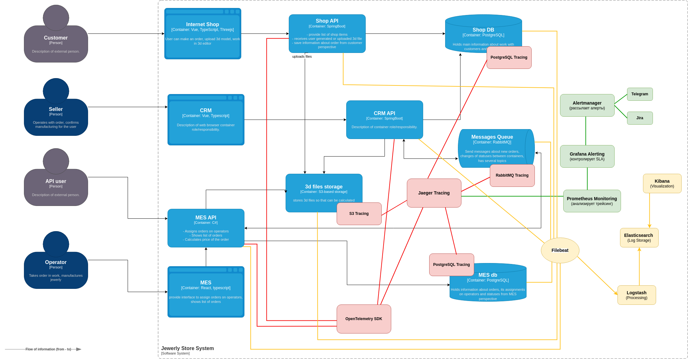

# Архитектурное решение по логированию

## Анализ системы «Александрит» и C4-диаграммы в контексте планирования логирования

Логирование необходимо для отслеживания событий, диагностики ошибок и аудита действий в системе. Логи позволяют:
- Анализировать жизненный цикл заказов.
- Находить ошибки и отказы сервисов.
- Выявлять аномалии и подозрительную активность.

**Ключевые системы, из которых собираем логи:**
- Shop API → обработка заказов в интернет-магазине.
- CRM API → изменение статусов заказов.
- MES API → управление производством.
- RabbitMQ → передача заказов между системами.
- PostgreSQL (Shop DB, MES DB) → долгие запросы и ошибки.
- 3D Storage (S3) → загрузка моделей заказов.
- Jaeger, Prometheus, Grafana → мониторинг и трейсинг.
- Alertmanager → алерты по SLA.

**Как будет работать логирование:**
1. Сервисы (Shop API, CRM API, MES API, RabbitMQ, DB, 3D Storage) → отправляют логи в Filebeat / Fluentd
2. Filebeat / Fluentd → передаёт логи в Logstash для обработки
3. Logstash → нормализует логи и отправляет их в Elasticsearch
4. Elasticsearch → хранит логи и делает их доступными для Kibana
5. Kibana → визуализирует логи и делает их доступными для анализа

Добавим в C4-диаграмму логирование (отобразим его жёлтым цветом):

Можно разделить логи на типы в порядке критичности и полноты информации, которую они предоставляют. Это называют уровнями логов. Их всего шесть:
- FATAL — отказ сервиса или оборудования.
- ERROR — ошибочное состояние. Например, «Пользователь заблокирован».
- WARN — состояние, которое близко к нестандартному поведению системы. Например, «Пользователь неправильно ввёл пароль».
- INFO — это штатное поведение. Такие логи обычно используют для записи обычных сообщений. Например, «Данные загружены».
- DEBUG обычно используют для отладки. На продакшн-серверах их не используют, чтобы не засорять логи лишней информацией.
- TRACE обычно используют в среде разработки и для отладки в тестовом окружении.

**Распишим подробнее логи уровня `INFO`, которые нужно собирать:**

| Источник | Событие | Что логируем? |
|---|---|---|
| Shop API | Создание заказа | timestamp, order_id, user_id, total_price, status="created" |
|Shop API | Изменение корзины | timestamp, user_id, cart_items, action=add/remove |
|CRM API | Изменение статуса заказа | timestamp, order_id, old_status, new_status, changed_by|
|MES API | Производство начато | timestamp, order_id, operator_id, status="manufacturing_started"|
|MES API	 | Производство завершено | timestamp, order_id, operator_id, status="manufacturing_completed"|
|RabbitMQ | Сообщение в очереди | timestamp, queue_name, message_id, processing_time|
|PostgreSQL (Shop DB) | Долгий SQL-запрос |	timestamp, query_text, execution_time_ms|
|3D Storage | Файл загружен | timestamp, order_id, file_name, file_size_mb, upload_time|
|Prometheus / Grafana | Нарушение SLA | timestamp, service_name, metric, threshold, actual_value|
|Alertmanager | Отправка алерта | timestamp, alert_type, severity, recipients|

Эти логи позволяют контролировать бизнес-процессы и выявлять проблемы.

Выпишим несколько примеров ошибок для другиз уровней:
- Уровень FATAL
	- Shop API  
		- База данных недоступна
		- Ошибка загрузки 3D-файла
		- Проблема с очередью RabbitMQ
	- CRM API 
		- База данных CRM недоступна
		- Проблема с аутентификацией
		- RabbitMQ переполнен / не отвечает
	- MES API 
		- Ошибка расчёта стоимости (MES завис)
		- MES DB недоступен
		- Фатальная ошибка в RabbitMQ
	- RabbitMQ (Очереди сообщений)
		- Очередь переполнена и отбрасывает сообщения
	- PostgreSQL (Shop DB, CRM DB, MES DB)
		- Переполнение дискового пространства
		- Ошибка в индексации или блокировке
	- 3D Storage (S3, Object Storage)
		- Достигнут лимит хранилища
	- Jaeger (Tracing System)
		- Не работает передача трассировок
	- Prometheus (Мониторинг)
		- Мониторинг недоступен
	- Alertmanager
		-  Алерты не отправляются
- Уровень ERROR:
	- Shop API 
		- Ошибка при создании заказа	
	- CRM API
		- Ошибка обновления статуса заказа	
	- MES API 
		- Производство невозможно 	
	- RabbitMQ 
		- Потеря сообщения	
	- PostgreSQL (Shop DB) 
		- Ошибка записи данных	
	- 3D Storage	
		- Ошибка загрузки файла
- Уровень WARN:
	- Shop API
		- Долгое создание заказа 
	- CRM API	
		- Заказ завис в статусе	
	- MES API	
		- Задержка производства	
	- RabbitMQ	
		- Очередь переполнена (>5000 сообщений)	
	- PostgreSQL (Shop DB)	
		- Частые повторные запросы
...

## Мотивация

#### Что даст компании внедрение логирования

1. Быстрое обнаружение и устранение проблем
	- ❌ Без логирования → Команда узнаёт о сбоях только после жалоб клиентов.
	- ❎ С логированием → DevOps-инженеры видят ошибки в реальном времени и могут оперативно реагировать.
2. Прозрачность работы системы
	- ❎ Логи помогают понять, на каком этапе заказа произошёл сбой.
	- ❎ Позволяют анализировать переполненные очереди RabbitMQ, медленные SQL-запросы, проблемы с API.
3. Оптимизация производительности
	- ❎ Логи SQL-запросов помогают выявлять медленные запросы и оптимизировать их.
	- ❎ Позволяют предотвращать перегрузку системы, анализируя ошибки с базами данных и очередями сообщений.
4. Улучшение SLA и опыта клиентов
	- ❎ Логирование помогает сократить время реакции на инциденты и повышает доступность системы.
	- ❎ Снижение количества просроченных заказов и жалоб от клиентов.
	
Команда не сможет сразу внедрить логирование и трейсинг во всех системах, поэтому важно определить приоритетные сервисы.

Критерии выбора приоритетных систем:
- Критичность для работы бизнеса – сбой в системе ведёт к потере заказов и клиентов.
- Частота инцидентов – сервисы с наибольшим числом сбоев должны покрываться первыми.
- Влияние на задержки заказов – важны системы, где происходят основные задержки.

**1. RabbitMQ (Очереди сообщений) – Самый высокий приоритет**
- Почему это важно:
	+ Если сообщения теряются в очередях, заказы не доходят до CRM/MES.
	+ Задержки в RabbitMQ → производство не получает задания, заказы просрочены.
- Какие логи собираем:
	+ Количество сообщений в очереди (если >5000 → проблема)
	+ Ошибки доставки сообщений (dead-letter queue logs)
	+ Время обработки сообщений (latency per message)
- Ожидаемый эффект:
	+ Снижение потерь заказов на 80% и ускорение обработки на 30%.
   
**2. MES API (Система производства) – Высокий приоритет**
- Почему это важно:
	+ MES рассчитывает стоимость заказа. Ошибки здесь блокируют производство.
	+ Если MES API зависает, операторы не получают заказы.
- Какие логи собираем:
	+ Ошибки расчёта стоимости (например, если расчёт длится >10 минут)
	- Статусы обработки заказов (начато, завершено, отменено)
	-  Ошибки обновления заказов в БД
- Ожидаемый эффект:
	+ Снижение просроченных заказов на 30-50% и ускорение расчёта стоимости на 40%.
   
**3. PostgreSQL (Shop DB, CRM DB, MES DB) – Высокий приоритет**
- Почему это важно:
	+ Медленные SQL-запросы вызывают задержки API и медленную обработку заказов.
	+ Ошибки БД → CRM не видит статусы заказов, MES не может обновить расчёты.
- Какие логи собираем:
	+ Долгие SQL-запросы (>500 мс, >1 сек)
	- Ошибки блокировки БД (Deadlocks, Lock Waits)
	- Переполнение диска БД
- Ожидаемый эффект:
	+ Снижение API-латентности на 40% и ускорение работы БД.  
   
**4. Shop API (Интернет-магазин) – Средний приоритет**
- Почему это важно:
	+ Ошибки Shop API → пользователи не могут оформить заказ.
	+ Проблемы с загрузкой 3D-файлов могут блокировать кастомные заказы.
- Какие логи собираем:
	+ Ошибки создания заказа
	- Загрузка 3D-файлов в S3
	- Долгие запросы к Shop DB
- Ожидаемый эффект:
	+ Снижение ошибок заказов на 50% и ускорение загрузки 3D-файлов.   
   
**5. CRM API (Система управления заказами) – Средний приоритет**
- Почему это важно:
	+ Если CRM API зависает, менеджеры не могут видеть заказы.
	+ Ошибки в CRM могут ломать бизнес-процесс.
- Какие логи собираем:
	+ Изменения статусов заказов (старый → новый статус)
	- Ошибки RabbitMQ (потерянные сообщения)
	- Долгие SQL-запросы в CRM DB
- Ожидаемый эффект:
	+ Оптимизация работы CRM и снижение задержек обработки заказов.

## Предлагаемое решение

Для сбора, обработки, хранения и анализа логов используется ELK-стек (Elasticsearch, Logstash, Kibana) + Filebeat.

Компоненты логирования:
| Компонент | Функция |
|---|---|
| Filebeat | Сбор логов из API, RabbitMQ, БД, S3, системы мониторинга|
| Logstash | Обогащение, фильтрация и отправка логов в хранилище |
| Elasticsearch | Централизованное хранилище логов |
| Kibana |	Визуализация логов, построение дашбордов и поиск ошибок|

Какие компоненты нужно внедрить или доработать:
- Добавить Filebeat в API (Shop, CRM, MES) → логирование HTTP-запросов, статусов заказов
- Настроить Logstash → фильтрация чувствительных данных
- Развернуть Elasticsearch кластер → для масштабируемого хранения логов
- Добавить Kibana → анализ логов, быстрый поиск ошибок
- Настроить ротацию логов и политики безопасности

_cм диаграмму выше в п.1_   
P.S есть [реализация в формате drawio](jewerly_c4_model_log.drawio)

**Политика безопасности логов:** 
- Маскирование персональных данных (PII) перед сохранением
- Фильтрация полей в Logstash (удаление user_id, email, phone_number)
- Обнаружение утечек (DLP - Data Loss Prevention) в логах
- Кто имеет доступ к логам:
 	- Разработчики → Только технические ошибки, без персональных данных
	- DevOps → Полный доступ к логам инфраструктуры (API, БД, RabbitMQ)
	- Безопасность (Security Team) → Аудит логов для выявления аномалий
	- Менеджеры, операторы → Нет доступа (чтобы исключить утечку данных
	
**Политика хранения логов:**
- Каждая система получает свой индекс в Elasticsearch (например, shop-api-logs, crm-api-logs)
- Используем горячие (fast) и холодные (archive) индексы
- Сжатие старых логов через ILM (Index Lifecycle Management)
- Установка сроков хранения логов
	- INFO (обычные события)	30 дней, 500 ГБ
	- WARN (предупреждения)	90 дней, 1 ТБ
	- ERROR / FATAL (критические ошибки)	180 дней	, 2 ТБ
	- После истечения срока хранения логи либо архивируются в S3, либо удаляются.
	
## 	Мероприятия для превращения системы сбора логов в систему анализа логов

Что нужно для системы анализа логов:
- Автоматический алертинг (предупреждение о критических событиях).
- Обнаружение аномалий (всплески активности, неожиданные сбои).
- Анализ угроз и DDoS-атак.
- Связывание логов с бизнес-процессами (например, рост ошибок → падение заказов).

**1.Настроить алертинг на критические события**   

Какие события должны вызывать алерты:
- Потеря связи с RabbitMQ -> Очереди сообщений не работают, заказы зависли	-> Немедленный алерт
- База данных не отвечает -> Shop DB / CRM DB / MES DB недоступны	-> Переключение на резервную БД, отправить уведомление
- Резкое увеличение 500 ошибок в API	-> Количество HTTP 500 > 5% от общего числа запросов -> Аварийное расследование проблемы
- Ошибки аутентификации (Brute-force атака) ->  1000 неудачных входов за минуту -> Блокировка подозрительных IP
- Очередь RabbitMQ переполнена (>5000 сообщений) -> Система не успевает обрабатывать запросы	-> Увеличить количество воркеров
- Задержка в MES API > 5 минут -> Производство не получает заказы вовремя -> Отправка уведомлений менеджерам
   
Реализация:
- Prometheus + Alertmanager → мониторинг логов и автоматические уведомления
- Grafana Alerting → дашборды с визуальными тревогами.

**2. Обнаружение аномалий в логах**
   
Пример аномалии: резкое увеличение числа заказов с 4 в секунду до 10 000   
Возможные причины:
- DDoS-атака (конкуренты пытаются перегрузить сервер).
- Ошибка в логике API (например, бесконечный цикл заказов).
- Мошеннические действия (боты создают заказы с фейковых аккаунтов).
   
Какие аномалии отслеживать:
- Всплеск новых заказов (Количество заказов внезапно выросло в 100 раз)
- Слишком много 500 ошибок в API (Возможна поломка сервиса)
- Резкое увеличение отказов аутентификации (Возможная атака перебором паролей)
- Переполнение диска БД	 (Логи / индексы слишком быстро растут)
- Время обработки заказа сильно возросло (Производство работает медленно)

Как искать аномалии:
- Elasticsearch Machine Learning (ML) → автоматически анализирует тренды.
- Prometheus anomaly detection (rate limit monitoring) → фиксирует всплески событий.
   
**3. Защита от DDoS-атак и мошеннических действий**

Как понять, что идёт DDoS:
- Всплеск HTTP-запросов на API без увеличения реальных заказов.
- Аномально высокая нагрузка на сервер без причины.
- Большое число неудачных логинов за короткое время.
   
**4. Визуализация логов и аналитика**

Как делать анализ логов удобнее:
- Графики ошибок в реальном времени (Grafana)
- Дашборды по заказам, API и базе данных (Kibana)
- Система отчётов для менеджеров (например, всплески отмен заказов)

## Критерии для выбора технологии для работы с логами

Выбор технологии логирования зависит от ключевых критериев, таких как: 
- масштабируемость, 
- стоимость, 
- удобство поиска логов и 
- уровень интеграции с инфраструктурой

Таблица сравнения технологий логирования:

| Критерий | ELK | OpenSearch (Self-Hosted)| Splunk | Grafana Loki | Graylog |
|---|---|---|---|---|---|
|Лицензия| Elastic License(ограниченная)|	Apache License, Version 2.0 (открытая) |	Проприетарная | Open Source (Apache 2.0) | Open Source (GPLv3)|
|Масштабируемость|Хорошая, но требует тюнинга|Высокая, горизонтально масштабируется|Отличная, но дорого|Ограниченная, лучше для малых нагрузок| Хорошая, подходит для средних систем|
|Стоимость владения (TCO)|Высокая (потребляет много ресурсов)|Дешевле, чем ELK (без подписки)|Дорогая лицензия|Очень дешёвая|Открытая и бесплатная|
|Скорость поиска логов|Высокая (индексы в Elasticsearch)|Высокая (индексы OpenSearch)|Отличная|Средняя (нет индексации)|Средняя|
|Интеграция с облаком|Поддерживает|Поддерживает|Поддержка облака, но дорого|Самостоятельное развёртывание|Ограниченная поддержка|
|Поддержка структуры логов (JSON, syslog и др.)|Гибкая настройка (Logstash)|Полная совместимость|Поддерживает все форматы|Ограниченные возможности|Требует доработок|
|Легкость настройки и администрирования|Средняя (нужны настройки Logstash)|Средняя (нужно развертывать вручную)|Сложная настройка и лицензирование|Простая установка|Простая установка|
|Возможности визуализации|Kibana – мощный инструмент|OpenSearch Dashboards|Встроенные дашборды|Требует интеграции с Grafana|Ограниченные возможности|
|Производительность при больших объёмах данных|Хорошая, но требует кластеров|Высокая, горизонтально масштабируется|Высокая (но дорого)|Оптимизирована для потоковых логов|Хорошая, но не лучшая|
|Поддержка мониторинга аномалий и ML-анализа|Machine Learning в X-Pack (но платный)|OpenSearch поддерживает аномалии| Splunk Machine Learning|Нет|Нет|

### Обоснование выбора технологии логирования
   
**Почему ELK (Elasticsearch + Logstash + Kibana):**
- Плюсы:
	- Масштабируемость – поддерживает работу с большими объёмами логов и может работать в кластерном режиме.
	- Гибкость – поддерживает любые форматы логов (JSON, syslog, API-запросы, RabbitMQ-события).
	- Высокая производительность – индексы позволяют быстро искать логи даже в больших массивах данных.
	- Визуализация данных – мощные дашборды в Kibana позволяют анализировать метрики в реальном времени.
	- Анализ аномалий и атак – Kibana поддерживает машинное обучение для выявления подозрительных активностей.
- Минусы: 
	- Высокие требования к ресурсам.
	- Требует сложных настроек Logstash для фильтрации логов.
	
📌 ELK – это сбалансированное решение по возможностям и удобству.