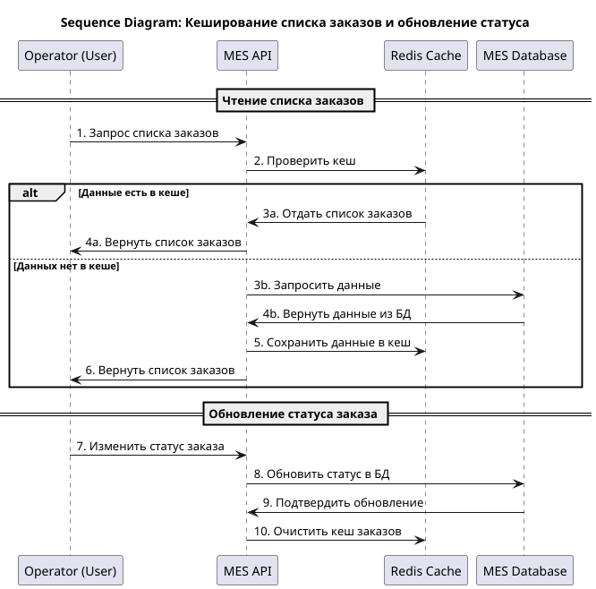

# Архитектурное решение по кешированию

## Анализ системы

MES работает медленно, что приводит к:
- Долгой загрузке страниц у операторов.
- Низкой скорости расчёта стоимости заказов.
- Жалобам клиентов на задержки выполнения заказов.

Анализ проблемы:
- MES API взаимодействует с RabbitMQ, MES DB и CRM API.
- Запросы операторов к дашборду MES требуют загрузки списков заказов и их статусов.
- Расчёт стоимости заказа в MES занимает от 2 до 30 минут, так как MES пересчитывает стоимость даже при повторном запросе.
- Высокая нагрузка на БД MES из-за повторяющихся запросов операторов.
   
✅ Решение – внедрение кеширования данных, которые не изменяются часто.
   
**Что будем кешировать:**
- Кеширование списка заказов для операторов
	+ ❌ Проблема:
		* Каждый раз при загрузке дашборда MES система делает тяжёлый SQL-запрос к БД.
		* Операторы часто обновляют страницу, но данные не меняются каждую секунду.
	+ ✅ Решение:
		* Используем Redis как кеш для хранения списка заказов.
		* Обновляем кеш раз в 30 секунд или при изменении статуса заказа.
- Кеширование расчёта стоимости заказов
	+  ❌ Проблема:
		*  Повторные запросы к MES API заставляют систему пересчитывать стоимость заказа, даже если он уже был рассчитан.
		*  Каждый расчёт может занимать до 30 минут, что тормозит работу.
	+ ✅ Решение:
		* Кешируем результаты расчёта стоимости заказа в Redis.
		* Если повторный запрос поступает в течение 12 часов, отдаем закешированное значение.
		* Если заказ изменён – очищаем кеш и запускаем новый расчёт.
- Кеширование справочной информации
	+  Что кешируем:
		*  Список материалов (металлы, камни).
		- Данные о поставщиках.
		-  Технические характеристики 3D-моделей.
	- Почему:
		- Эти данные редко изменяются, но запрашиваются очень часто.
	+ ✅ Решение:
		* Используем Redis для хранения данных на 24 часа.
		- Обновляем кеш при изменении данных.
   
Redis – лучший выбор для кеширования, потому что:
- Очень быстрый (ответ за миллисекунды).
- Позволяет устанавливать TTL (время жизни кеша).
- Поддерживает кластеризацию, если нагрузка будет расти.

## Мотивация

**Причины внедрения кеширование:**    
   
В системе «Александрит» MES испытывает проблемы с производительностью, что приводит к:   
- Медленной загрузке дашбордов операторов → большие SQL-запросы тормозят интерфейс.
- Долгому расчёту стоимости заказов → каждый запрос в API выполняет расчёты заново.
- Высокой нагрузке на базу данных → повторяющиеся запросы перегружают MES DB.
   
Решение – внедрение кеширования для уменьшения нагрузки и ускорения работы.
   
**Какие проблемы решает кеширование:**
- ✅ Ускорение работы операторов → дашборды MES загружаются мгновенно.
- ✅ Быстрое получение стоимости заказа → повторные запросы не требуют пересчёта.
- ✅ Снижение нагрузки на БД → меньше повторных SQL-запросов.
- ✅ Оптимизация работы API → уменьшение времени ответа API.
   
**Какие элементы системы будем кешировать:**
- Список заказов в дашборде операторов
- Рассчитанная стоимость заказа
- Справочная информация (материалы, поставщики)
   
## Предлагаемое решение

### Какой тип кеширования будем внедрять:
    
 ✅ Внедряем **серверное кеширование.**
   
Почему серверное, а не клиентское:
- Клиенты (операторы) обновляют страницу дашборда вручную → клиентский кеш неэффективен.
- Кеширование на сервере (Redis) позволяет обновлять данные централизованно.
- Безопасность – серверное кеширование не даёт клиенту доступ к сырым данным.
   
Клиентское кеширование подойдет для статических ресурсов (CSS, JS), но не для API-запросов и расчётов стоимости.
 
### Какой паттерн кеширования использовать:
   
 ✅ Будем использовать паттерн **Cache-Aside**.
    
 Cache-Aside:
 - Данные сначала запрашиваются из кеша (Redis).
 - Если данных нет в кеше, они берутся из БД и сохраняются в кеш.
 - Кеш обновляется при изменении данных (например, при изменении статуса заказа).
      
Почему Cache-Aside лучше всего подходит:
- Гибкость – работает для редко изменяемых данных.
- Обновляемость – кеш автоматически обновляется при изменении данных.
- Простая реализация – не требует сложных механизмов записи в кеш.
   
Почему НЕ Write-Through и НЕ Refresh-Ahead:
- ❌ Write-Through (Запись через кеш) – НЕ подходит
	- Запись в кеш выполняется сразу при изменении данных в БД.
   	- Минусы:
    		- При каждом изменении заказа нужно обновлять кеш → создаёт дополнительную нагрузку.
    		- Не даёт преимуществ для редко изменяемых данных (стоимость заказа, справочная информация).
- ❌ Refresh-Ahead (Предзагрузка кеша) – НЕ подходит
	- Кеш обновляется заранее, до поступления запроса.
	- Минусы:
		- Требует сложной логики предсказания, какие данные будут запрашиваться.
		- Неэффективен для списка заказов, где изменения происходят хаотично.	

**Итоговое решение:**
- Используем серверное кеширование в Redis.
- Применяем Cache-Aside для списков заказов, стоимости и справочных данных.
- Обновляем кеш только при изменении данных.   
_Это решение ускорит MES и уменьшит нагрузку на БД!_
 
 ### Диаграмма последовательности действий (Sequence diagram)

Нарисуем диаграмму последовательности действий (Sequence diagram). Отобразим там, как проходит операция чтения списка заказов и запись об изменении статуса заказа. 

P.S есть [код диаграммы в формате PUML](Sequence_Diagram.puml)

Как работает кеширование:
1. Проверка кеша (Redis):
	- Если данные есть в кеше → отдаются из Redis.
	- Если данных нет → запрашиваются из БД, кешируются и передаются пользователю.
2. Обновление статуса заказа:
	- Запрос идёт в БД.
	- После обновления статуса заказов кеш очищается, чтобы данные обновились.

**Это решение снижает нагрузку на БД и ускоряет работу MES API.**
 
### Cтратегия инвалидации кеша:

Инвалидация кеша — это процесс удаления устаревших данных из кеша, чтобы обеспечить актуальность информации.

В MES мы кешируем:
- Список заказов → чтобы ускорить работу операторов.
- Рассчитанную стоимость заказа → чтобы избежать повторных расчётов.
- Справочную информацию → чтобы снизить нагрузку на БД.

**Какие стратегии инвалидации кеша можно использовать:**
|Стратегия инвалидации|Описание|Плюсы|Минусы|
|---|---|---|---|
|Временная инвалидация  (TTL - Time-To-Live)|Данные удаляются через заданное время (например, 30 сек / 12 часов / 24 часа).|1.Простая реализация (встроено в Redis). 2.Хорошо работает для редко меняющихся данных.|1.Данные могут устареть раньше, чем TTL истечёт. 2.Возможны короткие периоды несоответствия данных.|
|Инвалидация по ключу (Key-Based Expiration)|Удаление кеша при изменении конкретного объекта (например, статус заказа изменился → удалить кеш).|1.Обеспечивает актуальные данные. 2.Можно сразу обновлять кеш после изменений.| 1.Требует доп. логики в коде. 2.Нужен механизм отслеживания изменений.|
|Программная инвалидация|Разработчики сами управляют удалением кеша в коде (например, очистка кеша при обновлении заказа).| 1.Полный контроль над кешем. 2.Можно гибко управлять инвалидацией.| 1.Сложно поддерживать. 2.Ошибки в коде могут привести к неправильной инвалидации.|
|LRU (Least Recently Used)|Redis сам очищает редко используемые данные при нехватке памяти.|1.Автоматически очищает кеш, предотвращая переполнение. 2.Не требует сложной логики.|1.Данные могут удалиться раньше, чем нужно. 2.Нельзя точно контролировать процесс.|

**Какую стратегию инвалидации используем в MES:**
   
✅**Комбинируем две стратегии:**
- ✅**Временная инвалидация** (TTL) для неизменяемых данных
	- Список заказов – TTL = 30 сек (актуальность данных без лишних SQL-запросов).
	- Рассчитанная стоимость заказа – TTL = 12 часов (если заказ не изменился, стоимость остаётся актуальной).
	- Справочная информация (материалы, поставщики) – TTL = 24 часа (редко меняется, но важно кешировать).
- ✅**Инвалидация по ключу** для изменяемых данных
	- При изменении статуса заказа – очищаем кеш вручную (del cache[order_list]).
	- При пересчёте стоимости заказа – очищаем кеш вручную (del cache[order_price]).

**Почему выбрана эта стратегия:**

- TTL (временная инвалидация)
	- Позволяет кешировать данные без сложной логики. 
	- Хорошо подходит для редко меняющихся данных.
- Инвалидация по ключу
	- Гарантирует актуальность данных после обновления. 
	- Позволяет оперативно удалять устаревшую информацию.
   
Эта стратегия ускорит работу MES, обеспечив баланс между производительностью и актуальностью данных. 