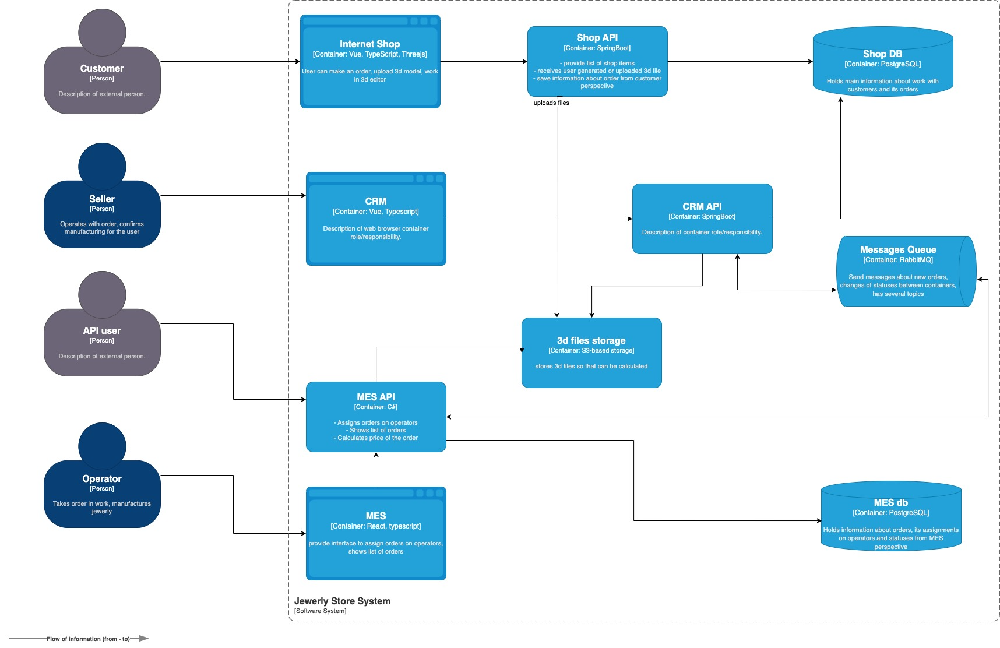

# architecture-sprint-4
Задание к спринту 4 ("Кеширование, построение мониторинга и адаптация к высокой нагрузке")

работа над кейсом компании «Александрит»

## Описание и проблемы компании

#### О компании

Компания «Александрит» занимается производством ювелирных украшений — готовых и на заказ. Фишка компании в том, что пользователь может самостоятельно разработать дизайн украшения. На сайте можно:
- загрузить свой файл с 3D-моделью изделия,
- воспользоваться конструктором, чтобы создать 3D-модель из готовых элементов.

Компания начинала с продажи простых ювелирных украшений, но потом решила попробовать производство на заказ, и оно «взлетело». Тогда же компания организовала своё производство изделий — до этого она перекупала изделия у других производителей.   

Сейчас у «Александрита» есть отдельная CRM для работы с клиентами и MES для производства.   

Компания купила софт MES вместе с исходным кодом. MES рассчитывает стоимость производства изделия на своей стороне, приложение онлайн-магазина в расчётах не участвует. Это была одна из причин, почему компания выбрала именно это решение. Расчёт стоимости в среднем занимает 2-3 минуты. Скорость расчёта зависит от количества полигонов в 3D-модели. Если модель сложная и детализированная, время обработки может достигать 30 минут.   

MES и CRM взаимодействуют друг с другом через RabbitMQ. Эту интеграцию реализовала команда «Александрита».

#### Проблемы компании

В этом году компания осваивает новые рынки сбыта. Нагрузка растёт линейно. В среднем каждый месяц «Александрит» получает на 100 заказов больше, чем в предыдущий. Но тут появились проблемы с заказами. Клиенты жалуются менеджерам по продажам, что они не получили заказ и над их изделием работают уже несколько месяцев, хотя обещали закончить за три недели. Проблемы не на стороне производства: производственные мощности позволяют справиться с заказами и могут обеспечить двукратный рост.   

Во втором квартале «Александрит» начал принимать заказы от других продавцов ювелирных изделий, чтобы дополнительно увеличить охват. Для этого компания открыла свой API, который MES использует для расчёта стоимости изделия. В этом сценарии заказ создаётся в CRM через получение сообщения из очереди от MES. Как только «Александрит» внедрил эту возможность, компанию завалило заказами. Но есть и обратная сторона: жалоб от клиентов на просроченные заказы стало ещё больше.   

Добавились жалобы со стороны пользователей API. Представители компаний ежедневно сообщают, что не получили свои заказы.   

Участились жалобы от операторов: когда они заходят на первую страницу MES, система долго прогружается. На первой странице отображается список заказов в работе по статусам — это дашборд с фильтром. Раньше страница показывала все заказы, но это тормозило загрузку. Команда сделала фильтр по статусам и пагинацию, но это не помогло. Операторам важно видеть самые новые заказы, потому что от этого зависит их вознаграждение, — кто взял заказ, тот и получит оплату.   

Через месяц после открытия API компания потеряла уже несколько крупных контрактов из-за проблем с заказами. Недовольство клиентов онлайн-магазина (B2C) тоже растёт.    

## Как устроена архитектура

Система состоит из трёх приложений:
- Онлайн-магазин — написан на Vue и Java Spring Boot.
- CRM — SPA-приложение, фронтэнд написан на Vue, бэкенд — на Java Spring Boot.
- MES — SPA-приложение, фронтенд написан на React, бэкенд — на C#.
   
Во всех приложениях есть аутентификация и авторизация. Договоримся, что там проблем нет. Вы можете не брать во внимание эту функциональность при работе над заданием.
   
Вот схема текущей архитектуры в модели C4:

Окружений всего три: dev, release и prod. 
   
Если говорить про инфраструктуру, то сервис начинался как on-premise. Сейчас всё уже перенесли в облако. Каждый из инстансов крутится как EC2, базы данных — это Managed services на Yandex Cloud. Каждое приложение имеет по одному инстансу. Базы данных имеют один инстанс, который работает на запись и на чтение.

CI/CD реализован так:   
- Деплой в dev-окружение осуществляется автоматически после мёрджа пул-реквеста и прохождения юнит-тестов.
- В release-окружения версию деплоят вручную.
- В продакшн версию тоже деплоят вручную.

#### Статусы заказа

Вот описание статусов заказа. В скобках указана система, в которой происходит изменение:
- INITIATED [онлайн-магазин] — пользователь завёл новый заказ или положил товары в пустую корзину.
- FILE_UPLOADED [онлайн-магазин] — пользователь загрузил файл с 3D-моделью или создал его с помощью конструктора.
- SUBMITTED [онлайн-магазин] — пользователь нажал на кнопку «Сделать заказ».
- PRICE_CALCULATED [MES] — система посчитала стоимость заказа.
- MANUFACTURING_APPROVED [CRM] — заказ подтверждён, его можно отдавать в производство.
- MANUFACTURING_STARTED [MES] — оператор взял заказ в работу.
- MANUFACTURING_COMPLETED [MES] — оператор выполнил заказ.
- PACKAGING [MES] — оператор начал упаковывать заказ.
- SHIPPED [MES] — заказ отправлен покупателю.
- CLOSED [CRM] — заказ завершён. Он закрывается после получения сообщения от транспортной компании или вручную.

#### Кто есть в команде

В инженерной команде, кроме вас, работает ещё восемь человек:
- Фронтенд — два инженера Vue, один частично знает React.
- Бэкенд — два инженера Java, один разработчик на C#.
- QA — один инженер по ручному тестированию, хочет заняться автоматизацией и уже делал несколько прототипов.
- Тимлид — бывший разработчик на C#.
- Продакт-менеджер — общается с бизнесом, отвечает за поддержку приложения.
- Один DevOps-инженер.
На стороне бизнеса в «Александрите» работают:
- Продавцы — это пользователи CRM.
- Операторы — пользователи MES.
- Администраторы — к ним относятся продакт-менеджер, тимлид и менеджеры по продажам.

Учитывайте, что наём потенциально активный. Компания может набрать ещё людей, но нужно обосновать, кто и зачем нужен.

#### Как выстроены процессы

Команда выпускает софт двухнедельными спринтами. Есть тестовое окружение, на нём QA-инженер прогоняет E2E-сценарии вручную. Если он обнаруживает баги уровня high или highest, то версию не деплоят на продакшн до их починки. Это часто приводит к значительным задержкам релиза. Раньше задержки не превышали одного месяца, но в последнее время требуется всё больше и больше времени.   

Обсудили проблемы компании и текущее архитектурное решение. Теперь перейдём к заданиям.

## Задачи

### Задание 1. Анализ, идентификация проблем и решений, планирование

На этом этапе вам нужно проанализировать архитектуру, выявить проблемы и предложить решения.
- Идентифицируйте существующие и потенциальные проблемные места. 
- Разработайте инициативы, которые необходимы для устранения нежелательных ситуаций. 
- Расставьте инициативы в порядке приоритета.
	+ Какой вы видите целевую архитектуру через полгода?
	+ Если бы у вас была возможность выполнить только три пункта из списка инициатив в ближайшие полгода, что бы вы выбрали и почему? Не обязательно добавлять в список только эпики. Вы можете включить в план как крупные изменения, так и локальные задачи.

Решение: ["Планирование: анализ, идентификация проблем и поиск решений"](Exc1/Планирование:%20анализ,%20идентификация%20проблем%20и%20поиск%20решений.md)

### Задание 2. Мониторинг

Сайт «Александрит» подключён к Яндекс Метрике. Но с тех пор, как бизнес начал предоставлять оформление заказов через API, данные Яндекс Метрики уже не дают полной картины. Чтобы начать улучшать систему, вам нужно от чего-то отталкиваться. В этом задании вы запланируете внедрение мониторинга.  
 
Вам нужно определить, что вы хотите измерять и как вы будете это делать. А затем —  постараться обосновать свои решения для бизнеса. Не забывайте: бизнесу не всегда очевидно, что мониторинг стоит того, чтобы выделять на него ресурсы команды.

Нужно сделать:
- Проанализируйте систему компании и C4-диаграмму в контексте планирования мониторинга.
- Добавьте в файл раздел «Мотивация». Напишите здесь, почему в систему нужно добавить мониторинг и что это даст компании.
- Добавьте раздел «Выбор подхода к мониторингу». Выберите, какой подход к мониторингу вы будете использовать: RED, USE или «Четыре золотых сигнала». Для разных частей системы можно использовать разные подходы.
- Опишите, какие метрики и в каких частях системы вы будете отслеживать. Перед вами список метрик. Выберите метрики, которые вы считаете нужным отслеживать. Для выбранных метрик напишите:
	- Зачем нужна эта метрика.   
	- Нужны ли ярлыки для этой метрики. Если ярлыки нужны, опишите, какие именно вы планируете добавить.   
Вы можете не ограничивать себя только этим списком. Если вы видите, что стоит добавить какие-то ещё метрики, — добавьте и их тоже.
- Добавьте раздел «План действий». Напишите высокоуровнево, какие задачи вы видите для реализации. Это будет драфт технического задания. Например, «Создать инстанс time-series базы с использованием такой-то технологии».
- Дополнительное задание. Выберите показатели насыщенности — определите, что является пороговым значением насыщенности и почему нужно использовать именно такие показатели. Опишите, что должно происходить в системе в случае, если эти параметры будут превышены. Например, нужно завести тикет, добавить инстансов, написать письмо в саппорт, добавить автоматическую «звонилку» и так далее. 

Решение: ["Выбор и настройка мониторинга в системе.md"](Exc2/Выбор%20и%20настройка%20мониторинга%20в%20системе.md)

### Задание 3. Трейсинг

Команда видит, что заказы часто находятся в непонятном состоянии или зависают на каком-то сервисе внутри IT-ландшафта. Проблемы с заказами могут появляться и вовсе только потому, что сообщения теряются.   

Вам необходимо внедрить инструмент, с помощью которого команда сможет увидеть, что происходило с заказом и где он находится сейчас.

Нужно сделать:
- Проанализируйте систему компании и C4-диаграмму в контексте планирования трейсинга. Напишите и выделите на схеме системы, которые следует покрыть трейсингом. Для этого идентифицируйте места, где заказ может «сломаться» или зависнуть.
- Составьте список данных, которые должны попадать в трейсинг
- Добавьте в файл раздел «Мотивация». Напишите здесь, почему в систему нужно добавить трейсинг и что это даст компании. Опишите возможные три-пять технические и бизнес-метрики решения, на которые повлияет внедрение трейсинга.
- Добавьте раздел «Предлагаемое решение». Опишите, как и с помощью каких технологий будет реализован трейсинг, какие компоненты нужно внедрить или доработать. Отразите компоненты и новые связи на схеме. Скачайте диаграмму контейнеров Александрита» в модели C4. Доработайте диаграмму, исходя из вашего решения: отразите на ней новые компоненты и связи. Новые элементы выделяйте красным цветом, добавьте ссылку на схему в раздел «Предлагаемое решение».
- Добавьте раздел «Компромиссы». Опишите, в каких случаях трейсинг не принесёт пользы или пока невозможен, или его реализация обойдётся слишком дорого.  
- Проработайте аспекты безопасности. Опишите, какие меры для предотвращения несанкционированного доступа будут предусмотрены для системы трейсинга внутри компании и снаружи если это требуется.
- Дополнительное задание. Спроектируйте и опишите в разделе «Предлагаемое решение», как будет реализованы автоматический мониторинг процесса прохождения заказа, полученные из данных трейсинга, и алертинг. Обновите последний вариант диаграммы, который вы подготовили для этого раздела, — отразите на нём необходимые связи. Новые элементы выделяйте зелёным цветом. Добавьте отдельную ссылку на новый вариант диаграммы.

Решение:
["Архитектурное решение по трейсингу"](Exc3/Архитектурное%20решение%20по%20трейсингу.md)

### Задание 4. Логирование

Сейчас ошибки или нестандартные ситуации разбираются со слов клиента: клиенты рассказывают, как что-то пошло не так. Чтобы понять, что случилось, разработчикам и специалистам поддержки требуется очень много времени.   

Нужно найти системное решение, которое упростит разбор проблем внутри сервисов и снизит нагрузку поддержки.

Нужно сделать:
- Проанализируйте систему компании и C4-диаграмму в контексте планирования логирования. Опишите, какие логи нужно собирать и отметьте на схеме, из каких систем требуется сбор логов. Составьте список необходимых логов с уровнем INFO.   
Напишите, будете ли вы использовать другие уровни логирования и при каких обстоятельствах
- Добавьте в файл раздел «Мотивация». Напишите здесь, почему в систему нужно добавить логирование и что это даст компании. Опишите три-пять технические и бизнес-метрики решения, на которые может повлиять внедрение логирования.   
Команда не сможет реализовать единовременно логирование и трейсинг всех выделенных для этого систем. Поэтому опишите, для каких систем нужно настраивать логирование и трейсинг в первую очередь и почему.
- Добавьте раздел «Предлагаемое решение».
Опишите, как и с помощью каких технологий будет реализовано логирование, какие компоненты нужно внедрить или доработать. Отразите компоненты и новые связи на схеме.   
Проработайте политику безопасности в отношении логов. Проработайте политику хранения в отношении логов.
- Проработайте необходимые мероприятия для превращения системы сбора логов в систему анализа логов:
	- Нужно ли настроить какой-то алертинг?
	- Нужно ли искать аномалии? Например, было четыре записи о создании заказов и за секунду их стало 10 000. Возможно, происходит DDoS-атака конкурентами.
- Дополнительное задание. Проработайте критерии для выбора технологии для работы с логами и обоснуйте свой выбор через плюсы и минусы. Выделите не менее пяти критериев.

Решение: ["Архитектурное решение по логированию"](Exc4/Архитектурное%20решение%20по%20логированию.md)

### Задание 5. Кеширование

Итак, MES чувствует себя не очень хорошо. Операторы жалуются на низкую скорость работы со страницей, а новых клиентов не устраивает скорость выполнения заказа. Руководство «Александрита» просит вас разобраться с проблемой.   

Вам нужно подготовить документ с описанием вашего архитектурного решения. Он поможет вам объяснить бизнесу и разработчикам, что нужно сделать, чтобы решить проблему.    

В процессе разработки команда будет использовать артефакт как справочный документ. К таким документам удобно обращаться, если нужно понять, почему было принято то или иное решение.

Нужно сделать:
- Проанализируйте диаграмму системы и её описание. Решите, какую часть системы имеет смысл закешировать.
- Добавьте в файл раздел «Мотивация». Опишите здесь, почему вы предлагаете внедрить кеширование, какие проблемы оно должно решить и какие элементы системы вы планируете включить в кеширование.
- Добавьте раздел «Предлагаемое решение». Определите, какое кеширование вы будете внедрять — клиентское или серверное. Объясните, почему, на ваш взгляд, нужно использовать именно его. Если вы решите куда-то внедрить серверное кеширование, то поясните, какой паттерн будете применять — Cache-Aside, Write-Through или Refresh-Ahead. А также объясните, почему вы выбрали этот паттерн и почему остальные паттерны не подойдут или покажут себя хуже.
- Нарисуйте диаграмму последовательности действий (Sequence diagram). Отобразите там, как проходит операция чтения списка заказов и запись об изменении статуса заказа. Там же опишите процесс кеширования с указанием всех сущностей, которые участвуют в кешировании. Добавьте диаграмму в раздел «Предлагаемое решение».
- В блоке «Предлагаемое решение» опишите стратегию инвалидации кеша, которую вы планируете использовать. Объясните, какую стратегию инвалидации вы предлагаете (временную, по ключу, программную или другие), почему она подойдёт и почему не подойдут другие стратегии.
Не всегда очевидно, какое решение лучше. Чтобы выбрать оптимальный вариант, можете сделать сравнительный анализ в виде таблицы. 
- Дополнительное задание. Если вы считаете, что может быть несколько решений и вам сложно выбрать между ними, можете описать несколько вариантов. В таком случае в разделе «Предлагаемое решение» запишите как минимум два решения и подготовьте сопоставление в виде таблицы. 

Решение: ["Архитектурное решение по кешированию"](Exc5/Архитектурное%20решение%20по%20кешированию.md)